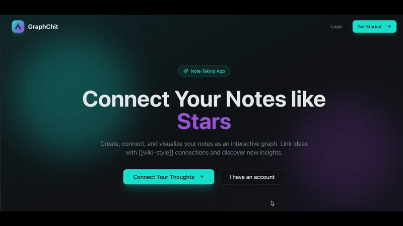

# GraphNote Studio



A modern application for managing your notes and graphs with ease.


## Tech Stack

- **Framework**: [React](https://reactjs.org/)
- **Build Tool**: [Vite](https://vitejs.dev/)
- **Language**: [TypeScript](https://www.typescriptlang.org/)
- **UI Components**: [shadcn/ui](https://ui.shadcn.com/)
- **Styling**: [Tailwind CSS](https://tailwindcss.com/)
- **Backend / Database**: [Supabase](https://supabase.com/)

## Getting Started

### Prerequisites

- [Node.js](https://nodejs.org/) (v18 or later)
- [npm](https://www.npmjs.com/) or [Bun](https://bun.sh/)

### Installation

1. Clone the repository:
   ```sh
   git clone https://github.com/pkkarn/grapchit-note-studio.git
   ```

2. Navigate to the project directory:
   ```sh
   cd graphnote-studio
   ```

3. Install dependencies:
   ```sh
   npm install
   ```

4. Set up environment variables:
   - Copy `.env.sample` to `.env`.
   - Fill in your Supabase credentials.

### Development

Run the development server:
```sh
npm run dev
```

The application will be available at `http://localhost:8080`.

## Scripts

- `npm run dev`: Start the development server.
- `npm run build`: Build the application for production.
- `npm run preview`: Preview the production build locally.
- `npm run lint`: Run linting checks.
